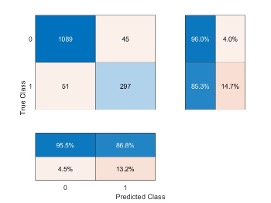
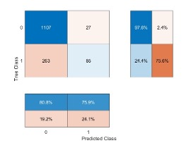
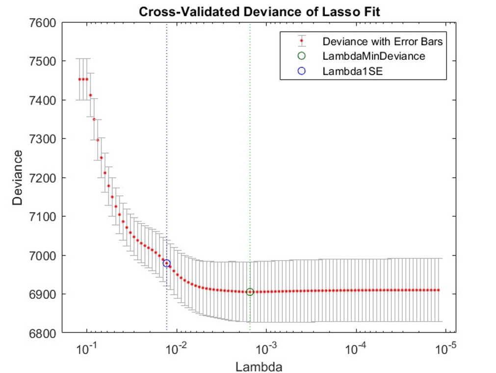

# Predicting Business Loan Repayment/Default
## Project Overview
Banks must assess the likelihood of loan repayment when lending to new companies, such as start-ups. If a company has a high probability of default, banks are less likely to lend money. Given this, a machine learning model can assist in determining whether a company will default on a loan. This project evaluates which model, Random Forest (RF) or Logistic Regression (LR), better aids banks in selecting eligible companies for loans.

## Project Files
- **Data**: Cleaned data is stored in the `data/` and raw data is in the `data/raw` folder.
- **Notebooks**: The notebook for data cleaning is located in the `notebooks/` folder.
- **Scripts**: MATLAB scripts for training and testing models are located in the `scripts/` folder.
- **Results**: Trained Random Forest and Logistic Regression models are saved in the `results/models` folder. Visualisations, such as confusion matrix, can be found in the `results/figures` folder, with initial data analysis visualisations in the `results/initial_analysis/figures` folder.

## Methodology 
- **Data Preprocessing**: Filter the SBA Kaggle dataset (1987-2014) to California’s science and technology sector, resulting in 7,412 observations with 12 relevant variables. Set a binary target (0 = “paid-in-full,” 1 = “default”) with imbalanced classes. Remove non-predictive variables (e.g., company name) to focus on repayment indicators.
- **Feature Engineering**: Add SBA_proportion to represent the SBA loan’s share of the total loan amount, and retain RevLineCr (despite its 0.79 correlation with SBA_proportion) due to its relevance. Use Pearson correlation to assess feature relationships.
- **Modeling**: Add Gaussian noise to the training set to address target imbalance, build baseline models, and optimise via hyperparameter tuning.
- **Evaluation**: Assess models using accuracy and confusion matrices on the test set. Apply 5-fold cross-validation post-tuning.
***Random Forest (RF)***: Use ROC curves and AUC.
***Logistic Regression (LR)***: Use cross-entropy loss.
- **Final Model Evaluation**: Compare RF and LR on test set using confusion matrices, ROC, and AUC to select the best model for loan repayment prediction.

  ***RF confusion matrix***
  
  

  ***LR confusion matrix***

  

## Key Findings
- **Model Comparison**: RF outperformed LR in accuracy and handling imbalanced data, while LR was more interpretable regarding feature significance. The RF model achieved a higher accuracy (93.5%) compared to LR (80.4%). Although LR had a slightly better recall (97.6% vs. RF’s 96.0%)—useful for identifying actual positive cases—RF had superior precision (95.5%) over LR (80.8%), making it more reliable for avoiding false positives. This reliability is critical in identifying companies likely to default. Additionally, RF performed better on the ROC curve, indicating effective handling of true positives and false positives. Testing times were low for both models: RF took slightly longer (0.121 seconds) than LR (0.005 seconds) on the current dataset size (7,000 observations). However, RF’s testing time is expected to increase more with larger datasets. Auto-tuning and cross-validation improved RF’s performance. Lasso regularisation (using MATLAB’s `lassoglm`) yielded a stable LR model by reducing non-informative features, although it showed relatively high cross-entropy error, limiting its effectiveness in this case.

  ***Lambda with lasso regularisation***

  
  
- **Challenges and Observations**: Both models achieved over 80% accuracy, though there remains a risk of overfitting due to the dataset’s imbalance and added noise. Careful noise addition is essential, as it can mislead models if complexity isn’t sufficient to generalise effectively. Future models should apply noise more cautiously.

## Used Datasets
- **U.S. Small Business Administration Data**: [SBA Dataset on Kaggle](https://www.kaggle.com/datasets/mirbektoktogaraev/should-this-loan-be-approved-or-denied)

## Environment
- **MATLAB**: R2023a update 4 (9.14.0.2306882), 64-bit(Window64)
